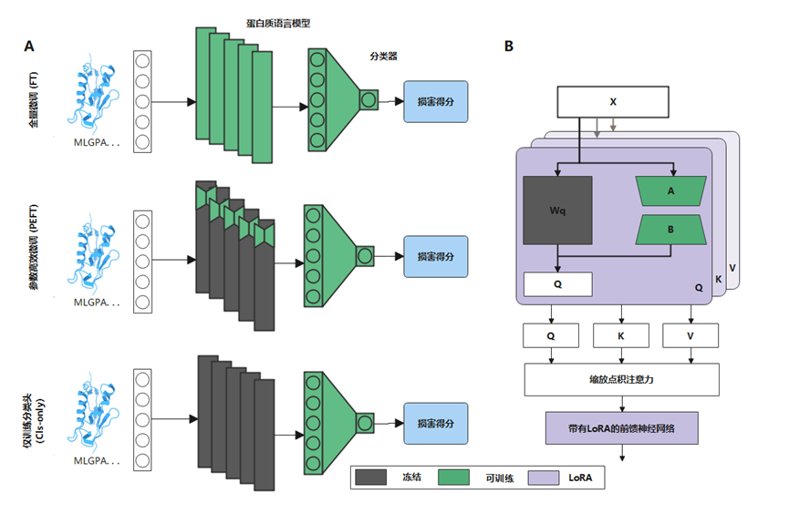

# LoRA-indel
This is a method for predicting in-frame pathogenic mutations by parameter-efficient fine-tuning of the ESM-2 model.


## install

####  Create and activate a new virtual environment
```
conda env create -f environment.ymlconda env create -f environment.yml
conda activate LoRA-indel
```


## Data Preparation
train.fasta for train protein sequence
test.fasta for test protein sequence
train.vcf for train data in vcf 
```
train_data_path = "dataCenter/train.fasta"
test_data_path = "dataCenter/test.fasta"
train_vcf_path = "dataCenter/train.vcf"
```

## Training and test LoRA-indel model
```shell
deepspeed --include=localhost:0 peft_esm_cv_tsf.py
```

## Related Files
| FILE NAME         | DESCRIPTION                                                                             |
|:------------------|:----------------------------------------------------------------------------------------|
| peft_esm_cv_tsf.py          | the main file of LoRA-indel predictor |
| models/models_FT.py          | model construction                                                                      |
| utils_esm.py           | utils used to build models                                                              |
| loss_functions.py | loss functions used to train models                                                     |
| dataCenter           | data                                                                                    |
| result            | Models and results preserved during training.                                           |
| saved_models              | Saved model weight                                                                           |


